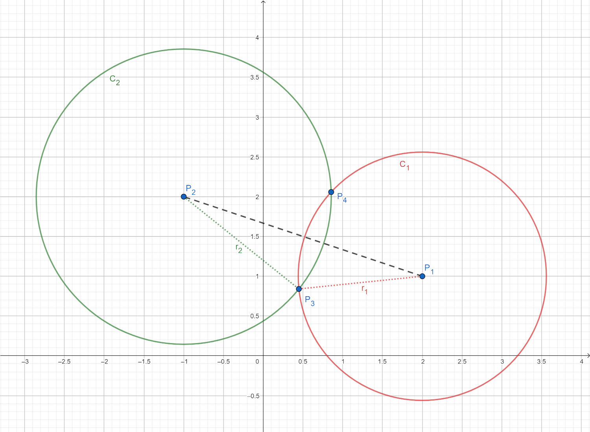
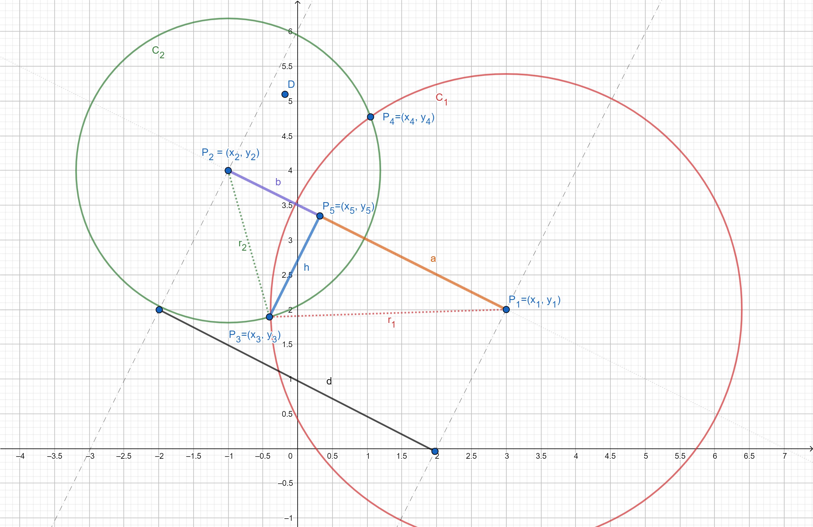
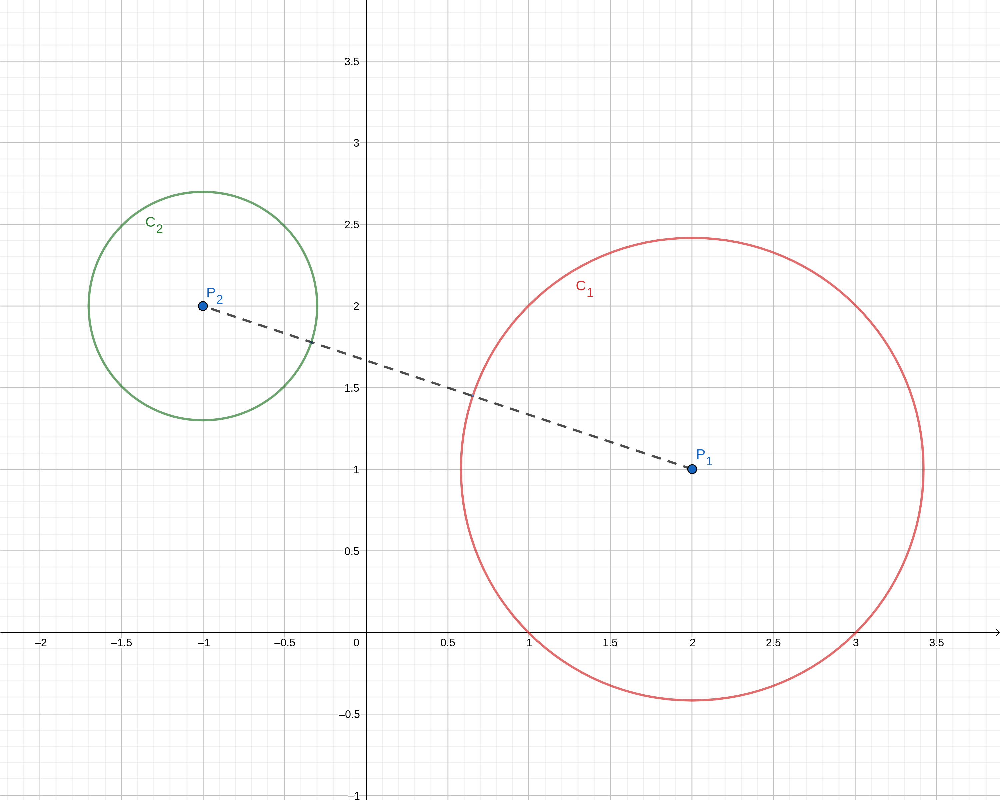
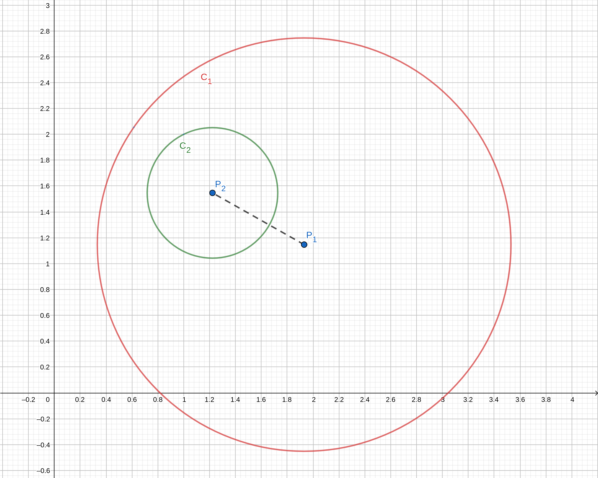
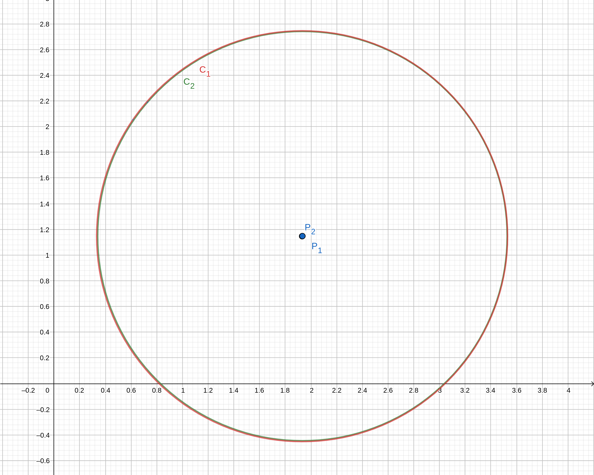
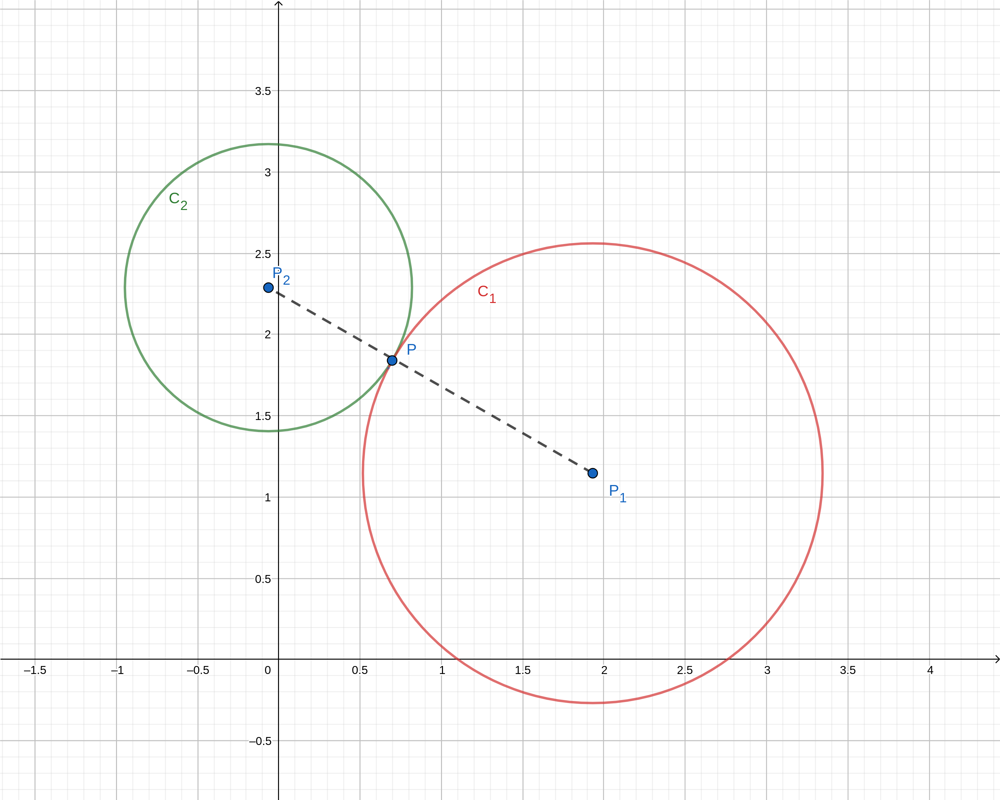
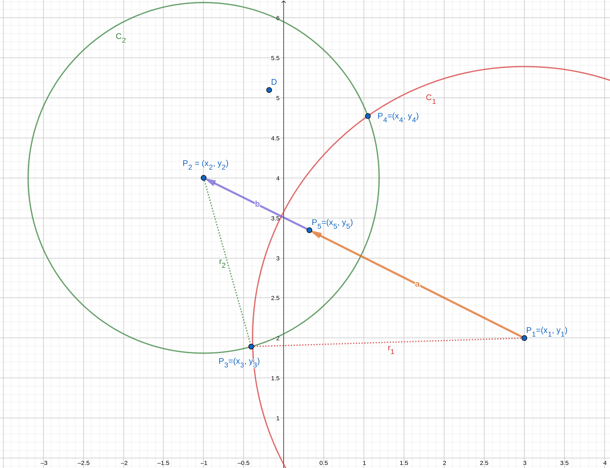

# How to calculate the intersection points of two circles

The aim of this page is to calculate the coordinates on the intersection points between two circles $C_1$ and $C_2$

Here are our hypotheses:

- center of circle $C_1$ is $P_1(x_1, y_1)$
- center of circle $C_2$ is $P_2(x_2, y_2)$
- radius of circle $C_1$ is $r_1$
- radius of circle $C_2$ is $r_2$

Our goal is to calculate the coordinates of the intersection points $P_3$ and $P_4$ as a function of $P_1, P_2, r_1$ and $r_2$

## Intermediate steps

Here are the intermediate steps for computing the intersection points:

1. Calculating the thistance $d$ between circle centers
2. Checking cases
3. Calculating the length of $a$ and $b$
4. Calculation of $h$
5. Calculating the coordinates of $P_5$
6. Calculation of vectors $\vec{P_5P_3}$ and $\vec{P_5P_4}$
7. calculating the coordinates of $P_3$ and $P_4$ 

## Distance between centers

Let's start by calculating the $d$, the distance between the centers. By applying the Pythagorean theorem we can write:

$ d = \sqrt{(x_2 - x_1)^2 + (y_2 - y_1)^2} $

## Checking cases

According to the values of $d$, we now have five cases:

- if $d > r_1 + r_2$ the circles are too far apart and do not intersect;
    
- if $d < |r_1 - r_2|$ one circle is inside the other and do not intersect;
  
- if $d = 0$ and $r_1 = r_2$ the circles are merged and there are an infinite number of points of intersection;
  
- if $d = r_1 + r_2$ there is a single intersection point;
  
- if $d < r_1 + r_2$ there are two intersection points.

## Calculating a and b

To calculte the distance $a$ let's start by writing $h$ as a function of $a$ and $b$. In the right triangles $P_1P_5P_3$ the Pythagorean theorem gives:

$r_1^2 = h^2 + a^2$

We can apply the theorem in the right triangle $P_2P_5P_3$:

$r_2^2 = h^2 + b^2$

By substituting we get the following equation:

$r_1^2 - r_2^2 = a^2 - b^2$

Since $d = a + b$

$\begin{cases}
   r_1^2 - r_2^2 = a^2 - b^2\\
   d = a + b
\end{cases}$

By injecting $b = d -a$ in equation, we obtain the following relation:

$r_1^2 - r_2^2 = a^2 -(d - a)^2$

The $-a^2$ terms on each side cancel out. You can then solve for $a$:

$
r_1^2 - r_2^2 = a^2 -d^2 -a^2 +2ad \\
r_1^2 - r_2^2 = -d^2 + 2ad \\
2ad = r_1^2 - r_2^2 + d^2
$

We get :

$a = {r_1^2-r_2^2 + d^2 \over 2d}$

Similarly in the triangle $P_2P_5P_3$ :

$b = {r_2^2-r_1^2 + d^2 \over 2d}$

All of these values are known:

- $r_1$ and $r_1$ are the radius of the circles
- $d$ has been calculated by equation

## Calculation of h

Once $a$ and $b$ are know, it becomes easy to calculate the length by apoplying the Pythagorean theorem in the right triangles $P_1P_5P_3$

$
r_1^2 = h^2 + a^2\\
h = \sqrt{r_1^2 - a^2}
$

## Coordinates of P5

The next step is to calculate the coordinates of $P_5$

Since the vectors $\vec{P_1P_5}$ and $\vec{P_1P2}$ are colinear, we can write:

$
\vec{P_1P_5 = {a \over d} \times \vec{P_1P_2}}
$

We can deduce the coordinates of $P_5$:
$x_5 = x_1 + {a \over d} \times (x_2 - x_1)$
$y_5 = y_1 + {a \over d} \times (y_2 - y_1)$

## Vectors $\vec{P_5P_3}$ and $\vec{P_5P_4}$

The second to last step is the calculation of vectors $\vec{P_5P_3}$ and $\vec{P_5P_4}$. Let's consider the vector  $\vec{P_1P_2}$ given by the following relation:

$\vec{P_1P_2} = \begin{pmatrix}
x_2 - x_1\\
y_2 - y_1
\end{pmatrix}
$

By multiplying this vector by a rotation matrix around the z-axis, we can calculate the perpendicular vectors:

__Clockwise__

$\vec{P_1P_2}^{\perp\circlearrowright} = \begin{pmatrix}
\space\space0 \space\space\space\space 1\\
-1 \space\space 0
\end{pmatrix} \times \begin{pmatrix}
x_2 - x_1\\
y_2 - y_1
\end{pmatrix} = \begin{pmatrix}
y_2 - y_1\\
x_1 - x_2
\end{pmatrix}
$

__Counterclockwise__
$\vec{P_1P_2}^{\perp\circlearrowleft} = \begin{pmatrix}
\space\space0 \space -1\\
1 \space\space\space\space\space 0
\end{pmatrix} \times \begin{pmatrix}
x_2 - x_1\\
y_2 - y_1
\end{pmatrix} = \begin{pmatrix}
y_1 - y_2\\
x_2 - x_1
\end{pmatrix}
$

We already calculated the norm of vector $\lVert \vec{P_1P_2} \rVert = d$ and norm of vectors $\lVert \vec{P_5P_3} \rVert = \lVert \vec{P_5P_4} \rVert = h$.
By applying the ratio $h \over d$ to the vectors $\vec{P_1P_2}$ we can deduce the expressions of vectors $\vec{P_5P_3}^\perp$ and $\vec{P_5P_4}^\perp$:

$
\vec{P_5P_3}^\perp = {h \over d} \times \vec{P_1P_2}^{\perp\circlearrowleft} = \begin{pmatrix} 
{{h(y_2 - y_1)}\over d}\\
{{h(x_1 - x_2)}\over d}
\end{pmatrix}
$

$
\vec{P_5P_4}^\perp = {h \over d} \times \vec{P_1P_2}^{\perp\circlearrowright} = \begin{pmatrix} 
{{h(y_1 - y_1)}\over d}\\
{{h(x_2 - x_1)}\over d}
\end{pmatrix}
$

## Intersection points

Once the vectors $\vec{P_5P_3}$ and $\vec{P_5P_4}$ are known, the coordinates of  ${P_3}$ and ${P_4}$ can be deduced by translating from these vectors. We finally get:

$
P_3 = \begin{pmatrix}
x_5 = - {{h(y_2 - y_1)}\over d}\\
y_5 = + {{h(x_2 - x_1)}\over d}
\end{pmatrix}
$

$
P_4 = \begin{pmatrix}
x_5 = + {{h(y_2 - y_1)}\over d}\\
y_5 = - {{h(x_2 - x_1)}\over d}
\end{pmatrix}
$

We can even rewrite this answer:

$x = x_5 \pm {{h(y_2 - y_1)}\over d}$
$y = y_5 \pm {{h(x_2 - x_1)}\over d}$